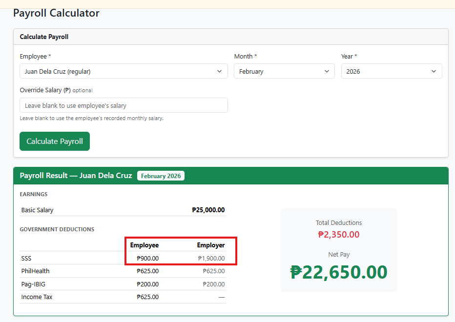
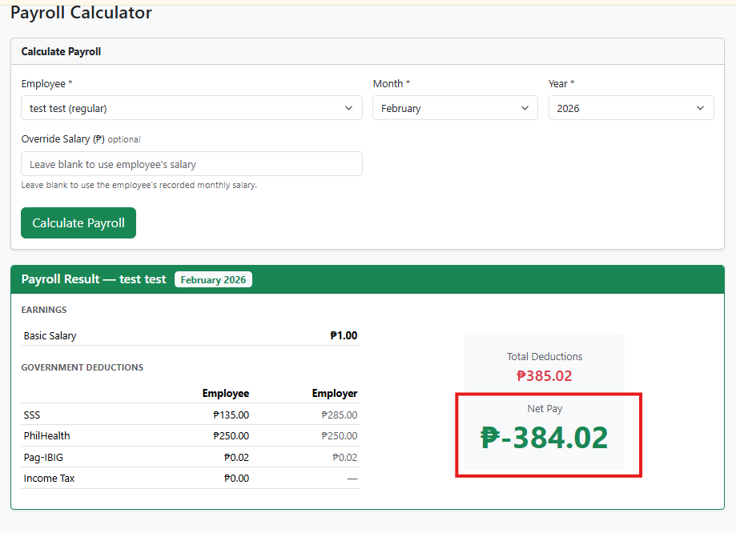
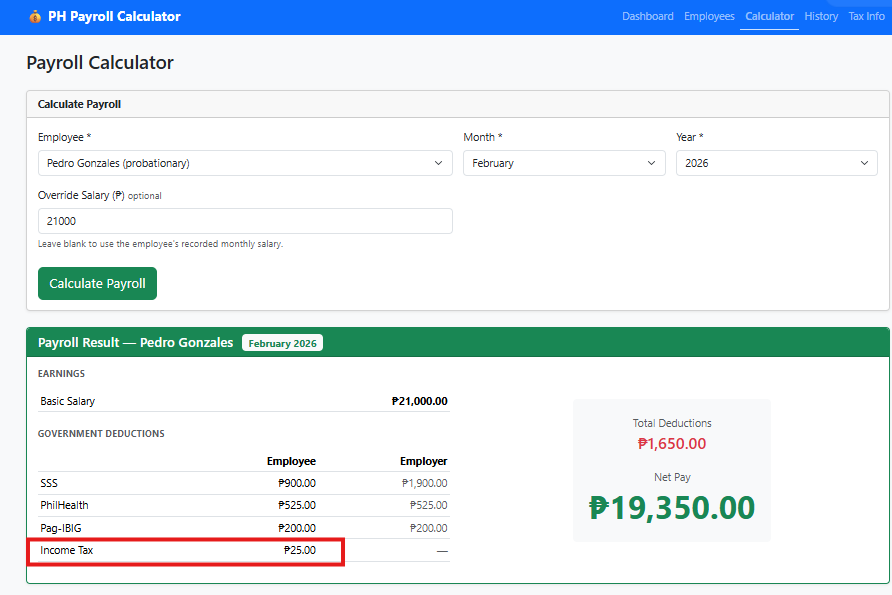
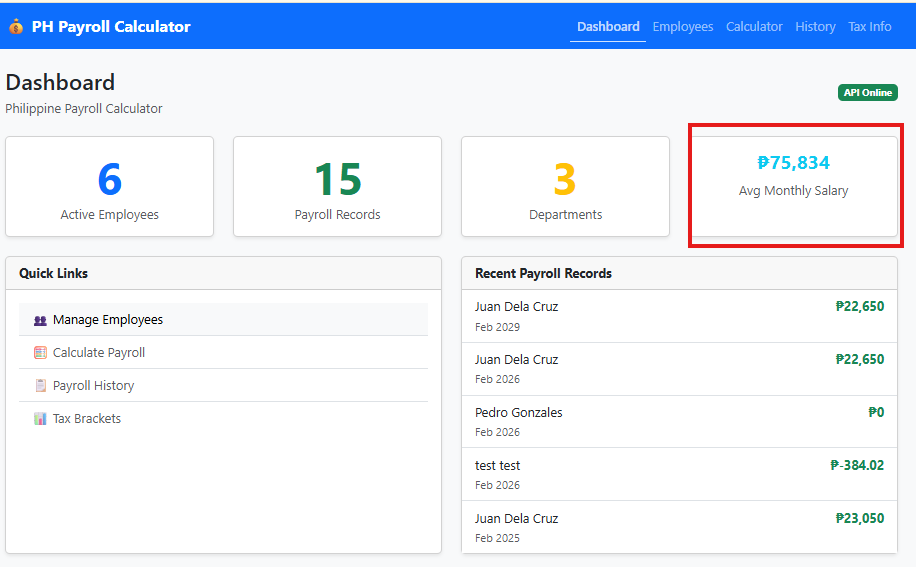
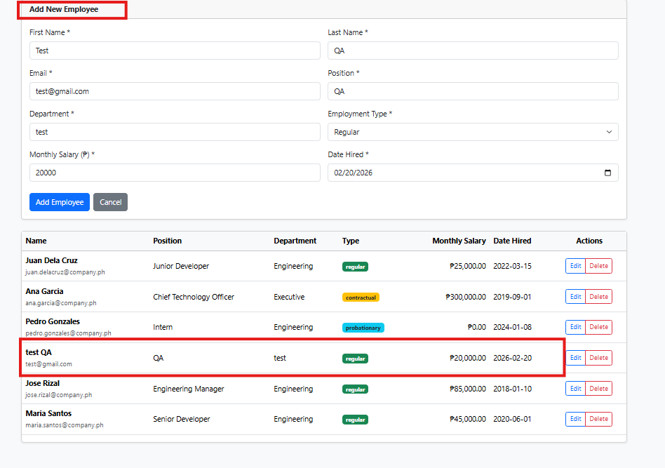
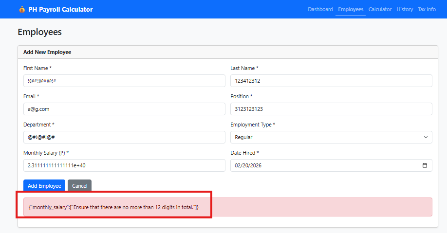

# **BUG REPORT**
Branch: feature-phPayrollCalc-applicant  
Module: PH Payroll Calculator  
Date: 02/19/2025

## ISSUE #001 

## Title: Incorrect Computation of SSS Employee and Employer Share Deductions
### Severity: High
### Steps to Reproduce
1. Go to the PH Payroll Calculator Dashboard and click Calculate Payroll under Quick Links
2. Select an Employee from the dropdown (e.g., Juan Dela Cruz (Regular)).
3. Keep the Month and Year fields unchanged.
4. Click the Calculate Payroll button.
4. Review the SSS deduction value.

### Expected Result
SSS deduction for employee and employer should match the official SSS contribution table based on salary bracket
#### e.g: If MSC is ₱25,000 (Employee Share) = 25,000 X 0.045 = ₱1,250

### Actual Result
System calculates an incorrect SSS deduction amount that does not align with the official contribution table

### Evidence
##### See Reference Below

Additional Notes: The deduction appears to be constant/fixed amount

## ISSUE #002 
## Title: Incorrect Computation of Net Pay
### Severity: High

### Steps to Reproduce
1. Go to the PH Payroll Calculator Dashboard and click Calculate Payroll under Quick Links
2. Choose an Employee from the dropdown (e.g., Juan Dela Cruz (Regular))
3. Override the Salary (e.g., ₱1.00)
4. Keep the Month and Year fields unchanged
5. Click the Calculate Payroll button
6. Verify the Net Pay value 

### Expected Result
Net Pay calculation should based on monthly salary minus total contributions
#### e.g. 21,000 - 1,570 = Estimated take home pay (Net Pay)

### Actual Result
System calculates an incorrect Net Pay amount due mismatch of total goverment deductions

### Evidence

##### See Reference Below

## ISSUE #003
## Title: Incorrect Computation of Income tax
### Severity: High
### Steps to Reproduce
1. Go to the PH Payroll Calculator Dashboard and select Calculate Payroll from Quick Links.
2. Select an Employee (e.g., Pedro Gonzales (Probationary)).
3. Override the Salary (e.g., ₱21,000).
4. Keep the Month and Year fields unchanged.
5. Click the Calculate Payroll button.
6. Verify the Income Tax value.

### Expected Result
System calculates an incorrect Income Tax amount and does not align with the official TRAIN Law Income Tax Brackets table

## Actual Result
System calculates an incorrect Income Tax, Computatuion should be verify and align with Tax Bracket table
#### e.g. Taxable Monthly Income X 12 months = Estimated Income Tax

### Evidence
##### See Reference Below

## ISSUE #004
## Title: UI/UX Inconsistency in Average Monthly Salary Section
### Severity: Low
### Steps to Reproduce
1. Go to the PH Payroll Calculator Dashboard
2. Notice the Avg  Monthly Salary Box

### Expected Result
`Avg  Monthly Salary` should be consistent with Overall UI/UX Design

## Actual Result
`Avg  Monthly Salary` font is too small with other section

### Evidence
##### See Reference Below

## ISSUE #005
## Title: Check for Existing Employees with Identical Information Before Adding
### Severity: Low
### Steps to Reproduce
1. Go to the PH Payroll Calculator Dashboard > Select Employees tab
2. Fill out the employee form using information that matches an existing record
3. Click Add Employee button

### Expected Result
Message should be `The employee being added has the same information as an existing record. Do you want to proceed?`

## Actual Result
No checking for Existing Employees with Identical Information

## Evidence
##### See Reference Below

## ISSUE #006
## Title: Toast Message enhancement when monthly salary is more than 12 digit
### Severity: Low
### Steps to Reproduce
1. Go to the PH Payroll Calculator Dashboard and select the Employees tab
2. Fill out the employee form
3. Enter a Monthly Salary with more than 12 digits
4. Click the Add Employee button
5. Observe the toast message

### Expected Result
Message should be `Monthly Salary should be not more than 12 digit`

### Actual Result
{"monthly_salary":["Ensure that there are no more than 12 digits in total."]}

### Evidence
##### See Reference Below

