# PH Payroll Calculator - QA Assessment Application

### Task 1: Manual Exploratory Testing 

## BUG 1

Title: Employer Pag-IBIG contribution is incorrectly capped

Severity: Medium

Steps to Reproduce:
    1.Open the Payroll Calculator. 
    2.Select Juan Dela Cruz. 
    3.Select December 2029. 
    4.Leave Override Salary blank. 
    5.Click Calculate Payroll. 
    6.Check the Pag-IBIG contribution under the Employer column. 

Expected Result:
    Employer Pag-IBIG contribution should be ₱500.00, calculated as:
    ₱25,000 x 2% = ₱500

Actual Result:
    Employer Pag-IBIG contribution is displayed as ₱200.00.

Evidence:
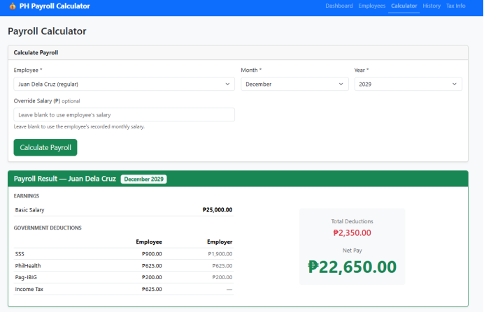

## BUG 2

Title: PhilHealth Employee and Employer Contributions Are Incorrectly Rounded Up

Severity: Low

Steps to Reproduce
    1.Open the Payroll Calculator.
    2.Select Juan Dela Cruz.
    3.Set the payroll month to April 2024.
    4.Set the Basic Salary to ₱33,333.33.
    5.Click Calculate Payroll.
    6.Check the PhilHealth contributions under Government Deductions.

Expected Result:
Based on the requirement that PhilHealth is 5% of basic salary, split 50/50:
    Total PhilHealth contribution:
    ₱33,333.33 x 5% = ₱1,666.6665
    Employee share: ₱833.33
    Employer share: ₱833.33
The system should apply the defined rounding rule consistently and should not produce a combined contribution exceeding the calculated 5% contribution.

Actual Result:
    The system displays:
    Employee PhilHealth: ₱833.34
    Employer PhilHealth: ₱833.34
    Total: ₱1,666.68
This results in a ₱0.01 over-calculation compared with the calculated total contribution of approximately ₱1,666.67.

Evidence:
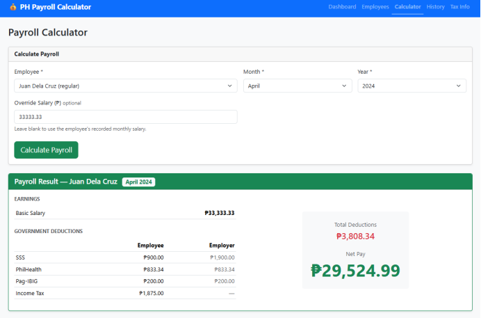

## BUG 3

Title: Income Tax is overstated for ₱300,000 monthly salary

Severity: High

Steps to Reproduce
    1.Open the Payroll application. 
    2.Create or select an employee with a Basic Salary of ₱300,000.00. 
    3.Set the payroll period to February 2025. 
    4.Calculate the payroll. 
    5.Review the Government Deductions section, particularly Income Tax. 

Expected Result:
Based on the provided TRAIN Law 2023 tax table:
    Monthly Basic Salary: ₱300,000.00 
    SSS Employee: ₱900.00 
    PhilHealth Employee: ₱2,500.00 
    Pag-IBIG Employee: ₱200.00 
    Monthly taxable income: ₱296,400.00 
    Annual taxable income: ₱3,556,800.00 
Since the annual taxable income falls within the ₱2,000,001–₱8,000,000 bracket:
    Annual tax = ₱402,500 + 30% × (₱3,556,800 − ₱2,000,000)
    Annual tax = ₱869,540.00
Expected monthly Income Tax:
    ₱869,540 ÷ 12 = ₱72,461.67
Therefore:
    Income Tax: ₱72,461.67 
    Total Deductions: ₱76,061.67 
    Net Pay: ₱223,938.33 

Actual Result:
    The system calculates:
    Income Tax: ₱73,541.67 
    Total Deductions: ₱77,141.67 
    Net Pay: ₱222,858.33 
The Income Tax is ₱1,080.00 higher than the expected amount, resulting in an understated Net Pay of ₱1,080.00.

Evidence:
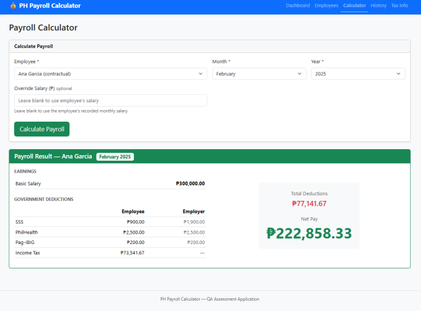

## BUG 4

Title: System allows negative basic salary and generates negative net pay

Severity: High

Steps to Reproduce
    1.Open the Payroll application. 
    2.Create or select an employee. 
    3.Enter a negative Basic Salary of ₱-6,000.00. 
    4.Set the payroll period to December 2029. 
    5.Calculate the payroll. 
    6.Review the Earnings, Government Deductions, and Net Pay sections. 

Expected Result:
    The system should reject negative salary values because a basic salary should not be below ₱0.00.
    An appropriate validation message should be displayed, such as:
    "Basic Salary must be greater than or equal to ₱0.00."
    The payroll calculation should not proceed until a valid salary is entered.

Actual Result:
The system accepts ₱-6,000.00 as the Basic Salary and generates a payroll result:
    Basic Salary: ₱-6,000.00 
    SSS: ₱0.00 
    PhilHealth: ₱0.00 
    Pag-IBIG: ₱0.00 
    Income Tax: ₱0.00 
    Total Deductions: ₱0.00 
    Net Pay: ₱-6,000.00 
The application therefore allows an invalid negative salary and produces a negative Net Pay.

Evidence:
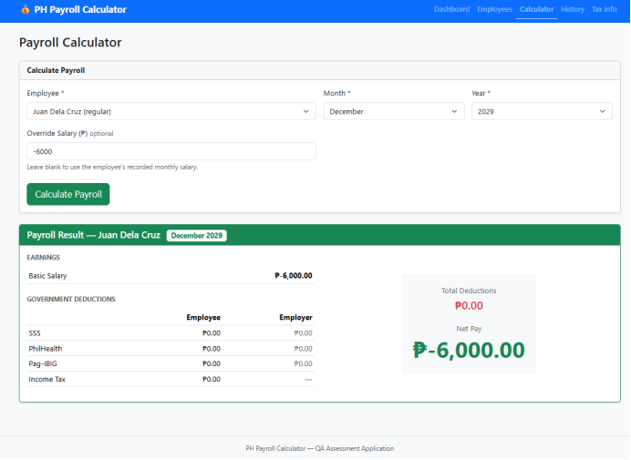

## BUG 5

Title: Income Tax is incorrectly calculated for extremely high basic salary

Severity: High

Steps to Reproduce
    1.Open the Payroll application. 
    2.Create or select an employee. 
    3.Enter a Basic Salary of ₱9,999,999.00. 
    4.Set the payroll period to December 2024. 
    5.Calculate the payroll. 
    6.Review the Government Deductions and Net Pay. 

Expected Result:
Based on the provided TRAIN Law 2023 tax table:
    Monthly Basic Salary: ₱9,999,999.00 
    SSS Employee: ₱900.00 
    PhilHealth Employee: ₱2,500.00 
    Pag-IBIG Employee: ₱200.00 
    Monthly taxable income: ₱9,996,399.00 
    Annual taxable income: ₱119,956,788.00 
Since the annual taxable income exceeds ₱8,000,000:
    Annual tax = ₱2,202,500 + 35% × (₱119,956,788 − ₱8,000,000)
    = ₱41,884,875.80 annual tax
Expected monthly Income Tax:
    ₱41,884,875.80 ÷ 12 = ₱3,490,406.32
Therefore, the expected result should be approximately:
    Income Tax: ₱3,490,406.32 
    Total Deductions: ₱3,494,006.32 
    Net Pay: ₱6,505,992.68 

Actual Result:
The system calculates:
    Income Tax: ₱3,450,207.98 
    Total Deductions: ₱3,453,807.98 
    Net Pay: ₱6,546,191.02 
The Income Tax is ₱40,198.34 lower than the expected amount, resulting in an overstated Net Pay of ₱40,198.34.

Evidence:
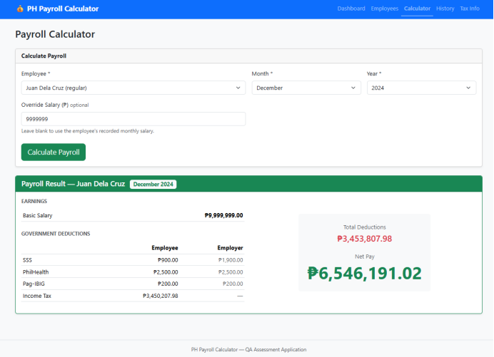

## BUG 6

Title: Government deductions exceed basic salary for ₱1.00 salary

Severity: High

Steps to Reproduce
    1.Open the Payroll application. 
    2.Create or select an employee. 
    3.Enter a Basic Salary of ₱1.00. 
    4.Set the payroll period to August 2026. 
    5.Calculate the payroll. 
    6.Review the Government Deductions and Net Pay. 

Expected Result:
The system should correctly apply the minimum salary bases and contribution rules for SSS, PhilHealth, and Pag-IBIG.
Based on the provided rules:
    SSS: The system should not calculate a ₱135.00 employee contribution from a ₱1.00 salary. The applicable SSS contribution should be determined using the appropriate minimum Monthly Salary Credit. 
    PhilHealth: The ₱10,000 minimum monthly salary base applies, so the employee contribution should be ₱250.00. 
    Pag-IBIG: The contribution should be calculated according to the applicable contribution rules and should not simply produce ₱0.02 from a ₱1.00 salary. 
    Income Tax: ₱0.00, since the salary is below the taxable threshold. 
Most importantly, the payroll system should not produce a Net Pay below zero due solely to mandatory deductions exceeding the employee's salary. The system should either reject an invalid salary amount or correctly handle minimum contribution bases according to the configured payroll rules.

Actual Result:
    The system accepts a Basic Salary of ₱1.00 and calculates:
    SSS Employee: ₱135.00 
    PhilHealth Employee: ₱250.00 
    Pag-IBIG Employee: ₱0.02 
    Income Tax: ₱0.00 
    Total Deductions: ₱385.02 
    Net Pay: ₱-384.02 
The employee's total deductions are ₱384.02 higher than the basic salary, resulting in a negative Net Pay.

Evidence:
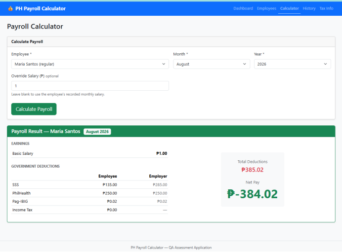

## BUG 7

Title: Income Tax is incorrectly calculated for ₱33,333.42 monthly salary

Severity: High

Steps to Reproduce
    1.Open the Payroll application. 
    2.Create or select an employee. 
    3.Enter a Basic Salary of ₱33,333.42. 
    4.Set the payroll period to April 2024. 
    5.Calculate the payroll. 
    6.Review the Government Deductions and Net Pay. 
    7.Compare the Income Tax calculation against the provided TRAIN Law 2023 tax brackets. 

Expected Result"
Using the provided contribution and TRAIN Law rules:
    Basic Salary: ₱33,333.42 
    SSS Employee: ₱900.00 
    PhilHealth Employee: ₱833.34 
    Pag-IBIG Employee: ₱200.00 
Monthly taxable income:
    ₱33,333.42 − ₱900.00 − ₱833.34 − ₱200.00 = ₱31,400.08
Annual taxable income:
    ₱31,400.08 × 12 = ₱376,800.96
This falls under the ₱250,001–₱400,000 tax bracket.
Annual income tax:
    15% × (₱376,800.96 − ₱250,000) = ₱19,020.14
Expected monthly Income Tax:
    ₱19,020.14 ÷ 12 = ₱1,585.01
Therefore:
    Expected Income Tax: ₱1,585.01 
    Expected Total Deductions: ₱3,518.35 
    Expected Net Pay: ₱29,815.07 

Actual Result:
    The system calculates:
    Income Tax: ₱1,875.02 
    Total Deductions: ₱3,808.36 
    Net Pay: ₱29,525.06 
The Income Tax is ₱290.01 higher than the expected amount, causing the Net Pay to be understated by ₱290.01.

Evidence:
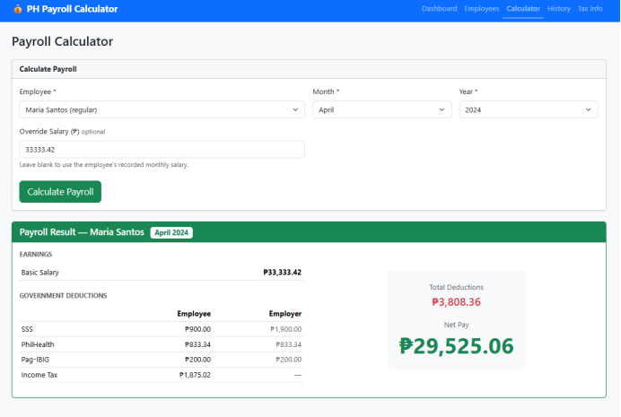

## BUG 8

Title: Income Tax is overstated for ₱66,666.75 monthly salary

Severity: High

Steps to Reproduce
    1.Open the Payroll application. 
    2.Create or select an employee. 
    3.Enter a Basic Salary of ₱66,666.75. 
    4.Set the payroll period to March 2026. 
    5.Calculate the payroll. 
    6.Review the Government Deductions and Net Pay. 
    7.Compare the Income Tax against the provided TRAIN Law 2023 tax brackets. 

Expected Result:
Using the provided payroll rules:
    Basic Salary: ₱66,666.75 
    SSS Employee: ₱900.00 
    PhilHealth Employee: ₱1,666.67 
    Pag-IBIG Employee: ₱200.00 
Monthly taxable income:
    ₱66,666.75 − ₱900.00 − ₱1,666.67 − ₱200.00 = ₱63,900.08
Annual taxable income:
    ₱63,900.08 × 12 = ₱766,800.96
This falls under the ₱400,001–₱800,000 tax bracket.
Annual tax:
    ₱22,500 + 20% × (₱766,800.96 − ₱400,000)
    = ₱95,860.19
Expected monthly Income Tax:
    ₱95,860.19 ÷ 12 = ₱7,988.35
Therefore, the expected payroll should be:
    Income Tax: ₱7,988.35 
    Total Deductions: ₱10,755.02 
    Net Pay: ₱55,911.73 

Actual Result:
The system calculates:
    Income Tax: ₱8,541.69 
    Total Deductions: ₱11,308.36 
    Net Pay: ₱55,358.39 
The Income Tax is ₱553.34 higher than the expected amount, resulting in an understated Net Pay of ₱553.34.

Evidence
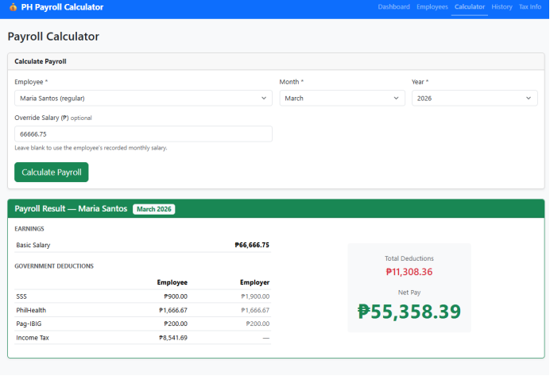

### Task 2: API Testing 

## BUG A

Title: API accepts and stores negative monthly salary

Severity: High

Steps to Reproduce
    1.Open Postman. 
    2.Send a request to create or update an employee record. 
    3.Set the monthly_salary field to a negative value, for example:
    {
    "monthly_salary": "-85000.00"
    }
    4.Send the request. 
    5.Check the API response and verify the employee record. 

Expected Result:
    The API should validate the monthly_salary field and reject negative salary values.
    The request should return an appropriate validation error, such as:
    400 Bad Request, or 422 Unprocessable Content 
    The API should provide a meaningful error message, for example:
    Monthly salary must be greater than or equal to 0.
    The invalid employee record should not be created or updated with a negative salary.

Actual Result:
The API accepts and stores the negative salary value.
The response contains:
{
    "id": 14,
    "first_name": "TestData",
    "last_name": "Exec",
    "full_name": "TestData Exec",
    "email": "testdata@gmail.com",
    "position": "QA",
    "department": "Engineering Dev",
    "employment_type": "regular",
    "monthly_salary": "-85000.00",
    "date_hired": "2026-01-10",
    "is_active": true
}
The employee record is successfully returned with:
monthly_salary: "-85000.00"
This indicates that negative salary validation is not being properly enforced by the API.

Evidence:
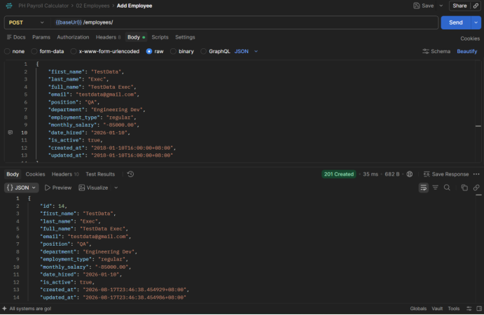

## BUG B

The employee record does not appear in the data/records when is_active is set to false.

Evidence:
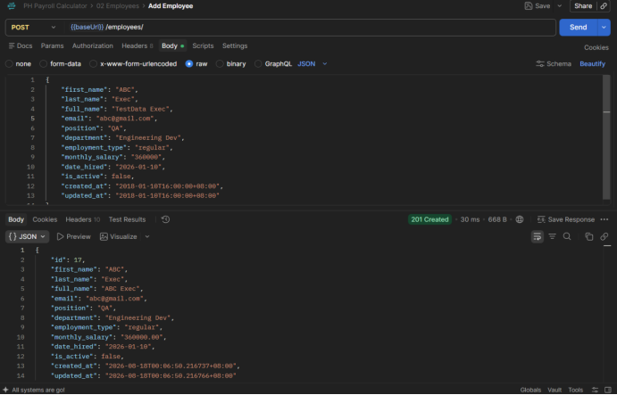

## BUG C

Deletion is not allowed.

Evidence:
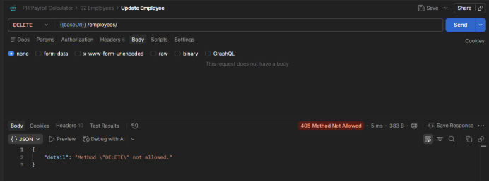

### Task 3: Write Automated Tests 

Here’s the file path for the automated tests I created using Playwright:
    e2e-tests\playwright\tests\additionalscripts.spec.js